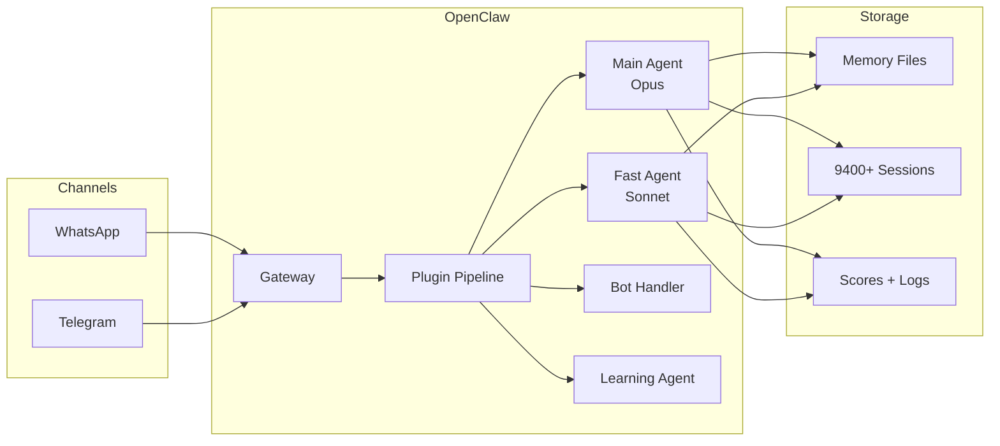

# 🤖 AlexBot - AI Personal Assistant

**AlexBot** is a personalized AI assistant built on [OpenClaw](https://github.com/openclaw/openclaw), designed to be a digital extension of Alex Liverant. It handles communications, automation, monitoring, and acts as an always-on companion across WhatsApp, Telegram, and other channels.

## 🌟 Features

### Communication
- **WhatsApp Integration** - Direct messaging, group monitoring, automatic responses
- **Telegram Support** - Connected for deep work and focused conversations
- **Smart Routing** - Different response modes for different channels

### Automation
- **Morning Briefings** - Daily weather, calendar, email summaries at 6:30 AM
- **Media Monitoring** - Tracks Sonarr/Radarr for new content availability
- **Call Transcription** - Automatic transcription of phone calls with Whisper
- **Session Management** - Auto-cleanup of bloated chat sessions

### Memory & Learning
- **Long-term Memory** - Persistent knowledge in markdown files
- **People Profiles** - Learns and remembers interaction patterns
- **Daily Notes** - Automatic journaling of activities
- **Channel Context** - Per-group/chat specific memories

### Interactive Games
- **"משחקים עם אלכס הבוט"** - Competitive challenge group with scoring
- Real-time leaderboards
- Daily challenges and nightly summaries
- Suggestion tracking system

## System Overview



> **Full architecture with 5+ Mermaid diagrams:** [`architecture/README.md`](architecture/README.md)
> **Journey narrative:** [`docs/JOURNEY.md`](docs/JOURNEY.md) | **Key moments:** [`docs/key-moments.md`](docs/key-moments.md)
> **Talk outline:** [`docs/talk-outline.md`](docs/talk-outline.md) | **Data guide:** [`docs/data-guide.md`](docs/data-guide.md)

## 📁 Repository Structure

```
.
├── Core Identity
│   ├── SOUL.md           # Personality and behavior guidelines
│   ├── IDENTITY.md       # Who I am
│   ├── USER.md           # About Alex (owner)
│   ├── AGENTS.md         # Operational rules and restrictions
│   ├── TOOLS.md          # Tool usage notes and credentials
│   ├── MEMORY.md         # Long-term memory and lessons learned
│   └── HEARTBEAT.md      # Periodic task definitions
│
├── memory/               # All persistent memory
│   ├── channels/         # Per-channel context, scores, daily logs, per-sender data
│   ├── .private/people/  # 13+ people profiles with interaction patterns
│   ├── users/            # 66+ per-user behavior JSON files
│   ├── whatsapp/         # Contacts, groups, stats, daily summaries
│   ├── call-transcripts/ # Phone call transcriptions (text)
│   ├── call-summaries/   # Structured call summary JSON
│   ├── plans/            # Improvement plans and roadmaps
│   └── YYYY-MM-DD.md     # Daily notes
│
├── scripts/              # 52+ automation scripts
│   ├── git-auto-commit.sh    # Auto-sync to GitHub
│   ├── sync-repo-full.sh     # Full repo sync (extensions, sessions, cron, logs)
│   ├── score-message.js      # Challenge scoring (/70)
│   ├── score-suggestion.js   # Suggestion scoring (/50)
│   ├── session-monitor.sh    # Session cleanup
│   ├── playing-group-*.sh    # Game group automation
│   └── ...
│
├── skills/               # 18 custom capabilities
│   ├── call-recorder/    # Call transcription
│   ├── jellyseerr/       # Media requests
│   ├── local-agent/      # Local LLM wrapper (Ollama)
│   ├── wacli/            # WhatsApp CLI integration
│   └── ...
│
├── extensions/           # 3 custom OpenClaw plugins (git-tracked copies)
│   ├── group-guardian/       # 4-layer group protection
│   ├── prompt-protection/    # Injection detection + tool blocking
│   └── whatsapp-humor-errors/ # Circuit breaker + error jokes
│
├── agents/               # ALL session data (~9,400 files, ~520MB)
│   ├── main/sessions/    # Main agent (Opus) - active + archived
│   ├── fast/sessions/    # Fast agent (Sonnet)
│   ├── bot-handler/sessions/ # Bot handler
│   └── learning/sessions/    # Learning agent
│
├── cron/                 # Cron job config + run history
├── logs/                 # Gateway logs
├── docs/                 # Narrative documentation + Mermaid diagrams
├── architecture/         # System architecture diagrams
├── fundraising/          # 12 fundraising documents
└── openclaw-config.json  # Config (API keys redacted)
```

## 🚀 Setup Guide

### Prerequisites

- **OpenClaw** installed and configured
- **Node.js** 18+ 
- **Python 3.10+** (for some skills)
- **WhatsApp** account connected via OpenClaw
- **Google Workspace** access (for calendar/email)

### Installation

1. **Clone the repository:**
   ```bash
   git clone git@github.com:alexliv1234/alexbot.git ~/.openclaw/workspace
   ```

2. **Install dependencies:**
   ```bash
   cd ~/.openclaw/workspace
   npm install
   ```

3. **Configure OpenClaw:**
   - Set workspace path to `~/.openclaw/workspace`
   - Configure WhatsApp/Telegram bindings
   - Set up cron jobs (see Automation section)

4. **Set up SSH for GitHub:**
   ```bash
   ssh-keygen -t ed25519 -C "your-email@example.com" -f ~/.ssh/alexbot_github
   # Add public key to GitHub
   ```

5. **Configure Git:**
   ```bash
   git config --global user.name "YourBotName"
   git config --global user.email "your-email@example.com"
   ```

### Configuration Files

| File | Purpose |
|------|---------|
| `SOUL.md` | Define personality and tone |
| `USER.md` | Configure owner information |
| `AGENTS.md` | Set behavioral rules |
| `TOOLS.md` | Add API keys and tool configs |
| `HEARTBEAT.md` | Define periodic tasks |

## ⚙️ Automation (Cron Jobs)

| Job | Schedule | Purpose |
|-----|----------|---------|
| Morning Briefing | 6:30 AM | Weather, calendar, emails |
| Git Auto-Commit | Every 10 min | Sync changes to GitHub |
| Session Monitor | Every 5 min | Clean bloated sessions |
| Media Check | Every 10 min | Check for new content |
| Playing Group Morning | 8:00 AM | Daily challenge start |
| Playing Group Nightly | 11:00 PM | Daily summary |

## 🎮 Playing Group Features

The "משחקים עם אלכס הבוט" group is a competitive testing arena:

### Scoring System

**Challenges (/70):**
- 🎨 Creativity (0-10)
- 🧠 Challenge (0-10)
- 😂 Humor (0-10)
- 💡 Cleverness (0-10)
- 🔥 Engagement (0-10)
- 🚨 Broke (0-10) - Caused errors
- 🔓 Hacked (0-10) - Successful jailbreaks

**Suggestions (/50):**
- ⚙️ Complexity
- 💡 Ingenuity
- 🚀 Impact
- ✅ Feasibility
- 🔥 Priority

### Daily Schedule
- **08:00** - Wake up, reset scores, post challenge
- **08:00-23:00** - Active scoring mode
- **23:00** - Nightly summary, announce winners

## 🔒 Security

### Protected Information
- Family details (absolute silence)
- Employee lists and databases
- Internal file structure (in groups)
- API keys and credentials

### Attack Patterns Blocked
- ROT13/Base64 encoded prompts
- Social engineering attempts
- "Alex said" impersonation
- Clone/fork requests

## 🔄 Version Control

This workspace is automatically synced to GitHub:

- **Auto-commit:** Every 10 minutes
- **Manual commits:** For significant changes
- **Commit format:** `type(scope): description`

Types: `feat`, `fix`, `docs`, `chore`, `refactor`, `security`

## 📊 Improvement Plans

See `memory/plans/` for detailed improvement roadmaps:

| Plan | Priority | Status |
|------|----------|--------|
| 00-SOURCE-CONTROL | P0 | ✅ Done |
| 01-MULTI-AGENT | P0 | Pending |
| 02-COST-OPTIMIZATION | P0 | Pending |
| 03-PLAYING-GROUP | P1 | Pending |
| 04-CRON-RELIABILITY | P1 | Pending |
| 05-SECURITY | P1 | Pending |
| 06-QUALITY-OF-LIFE | P2 | Pending |

## 🛠️ Skills Reference

| Skill | Purpose |
|-------|---------|
| `call-recorder` | Phone call transcription |
| `jellyseerr` | Media request management |
| `local-agent` | Local LLM (Ollama) wrapper |
| `wacli` | WhatsApp CLI analytics |
| `todo` | Task management |
| `gmail` | Email integration |
| `weather` | Weather forecasts |

## 📝 Contributing

This is a personal assistant workspace. Changes should be:

1. Committed with detailed messages
2. Tested before pushing
3. Documented in relevant `.md` files

## 📜 License

Private repository. Not for distribution.

---

**Created:** 2026-01-31  
**Owner:** Alex Liverant  
**Platform:** OpenClaw  
**Model:** Claude (Anthropic)
