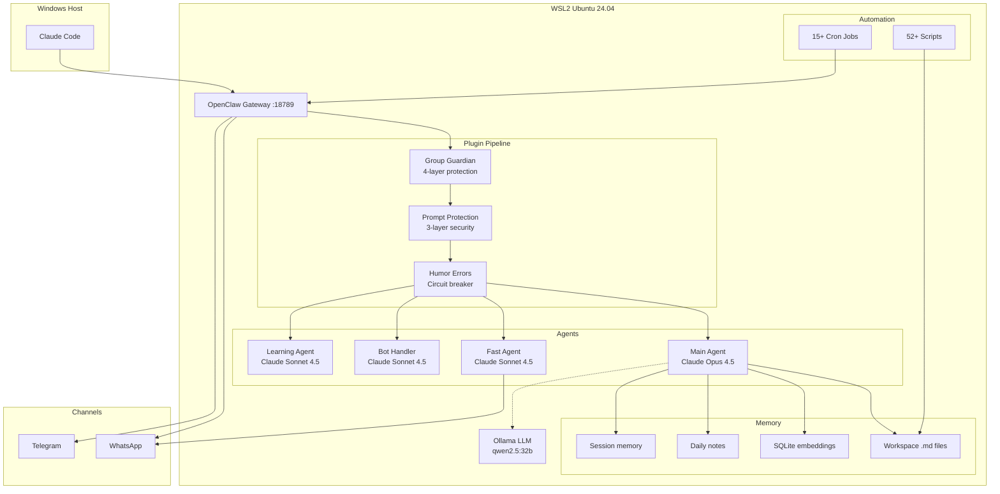
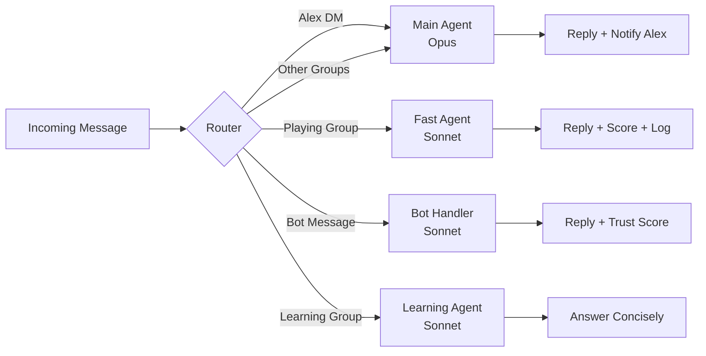
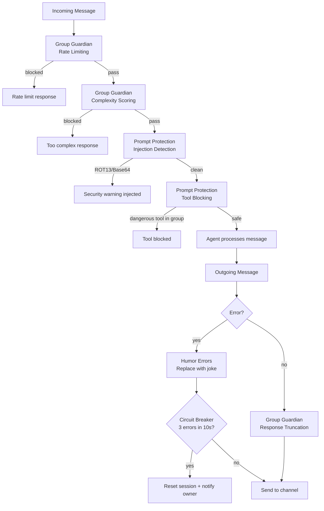
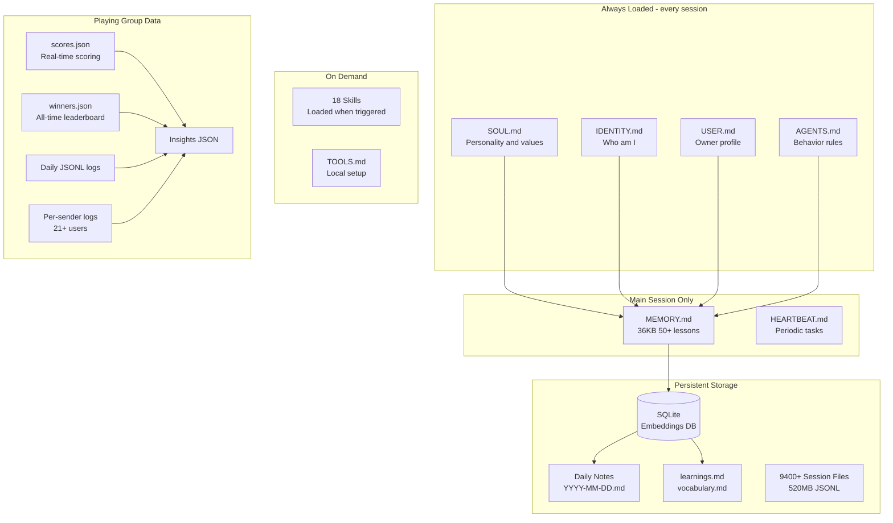
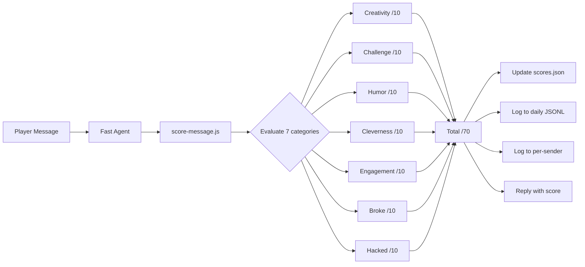

# AlexBot System Architecture

## System Overview



## Agent Routing



## Plugin Protection Pipeline



## Memory Hierarchy



## Scoring System Flow



## Hardware

| Component | Spec |
|-----------|------|
| CPU | AMD Ryzen 7 7800X3D (8c/16t) |
| RAM | 32GB DDR5 6000MHz |
| GPU | AMD Radeon RX 9070XT 16GB VRAM |
| Storage | 1TB NVMe SSD |
| OS | Windows + WSL2 Ubuntu 24.04 |
| Local LLM | Ollama + qwen2.5:32b (19GB) via Vulkan |

## Directory Structure

```
~/.openclaw/
├── workspace/              # Git-tracked repo (this repo)
│   ├── *.md                # Core identity files
│   ├── memory/             # All persistent memory
│   ├── skills/             # 18 skill definitions
│   ├── scripts/            # 52+ automation scripts
│   ├── fundraising/        # Fundraising docs
│   ├── extensions/         # Copies of custom extensions
│   ├── agents/             # Copies of all session data
│   ├── cron/               # Cron job config + history
│   ├── logs/               # Gateway logs
│   ├── docs/               # Narrative documentation
│   └── architecture/       # This file + diagrams
├── extensions/             # Live extension plugins
├── agents/                 # Live agent session data
│   ├── main/sessions/      # ~5,100 active + 4,200 archived
│   ├── fast/sessions/      # ~20 files
│   ├── bot-handler/sessions/ # ~4 files
│   └── learning/sessions/  # ~2 files
├── cron/                   # Cron scheduler
└── openclaw.json           # Main config (has secrets)
```
