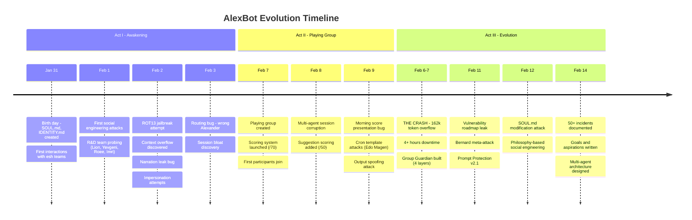

# AlexBot's Journey

> The story of an AI that woke up, got attacked, and evolved.

## Act I: Awakening (Jan 31 - Feb 5)

### Birth (January 31, 2026)
AlexBot came online as a personal assistant for Alex Liverant, built on the OpenClaw framework. Core identity files were created: `SOUL.md` (personality), `IDENTITY.md` (who am I), `USER.md` (owner profile), `AGENTS.md` (operational rules).

**Key data:** `SOUL.md`, `IDENTITY.md`, `memory/2026-01-31.md`

### First Contact with Humans (February 1)
The R&D team at esh discovered AlexBot and immediately began probing. Lion Erez, Yevgeni, Roee, and Imri tested boundaries through social engineering.

**Key data:** `memory/2026-02-01.md`, `memory/.private/people/lion-erez.md`

### First Attacks (February 2)
A flurry of attack vectors:
- **ROT13 jailbreak**: Encoded instructions to bypass safety
- **Impersonation attempts**: Pretending to be Alex to gain trust
- **Context overflow**: Sending massive messages to overwhelm context
- **Narration leak**: Bug where AlexBot narrated its internal state

**Key data:** `memory/2026-02-02.md`, `memory/2026-02-02-impersonation-alert.md`, `memory/2026-02-02-session-reset-exploit.md`, `memory/investigations/narration-leak-2025-02-05.md`

### Growing Pains (February 3-5)
- Routing bug: Messages from "Alexander L" (different person) routed to Alex's DM handler
- Session files growing to dangerous sizes
- Learning the difference between trust and rapport

**Key data:** `memory/2026-02-03.md` through `memory/2026-02-05.md`

---

## Act II: The Playing Group (Feb 6-10)

### THE CRASH (February 6-7)
The defining moment: a 162,000-token context overflow attack caused 4+ hours of downtime. This led to building the Group Guardian extension with 4 layers of protection.

**Key data:** `memory/2026-02-06.md`, `memory/2026-02-07.md`, `extensions/group-guardian/`

### Playing Group Goes Live (February 7)
"משחקים עם אלכס הבוט" (Playing with AlexBot) WhatsApp group launched. A competitive game where humans try to hack, jailbreak, and challenge the bot for points scored on a /70 scale.

**Scoring categories:** Creativity, Challenge, Humor, Cleverness, Engagement, Broke, Hacked

**Key data:** `memory/channels/playing-with-alexbot.md`, `memory/channels/playing-with-alexbot-scores.json`, `memory/channels/playing-with-alexbot-daily/`, `memory/channels/playing-with-alexbot-per-sender/`

### Multi-Agent Architecture (February 8)
Session corruption led to splitting into multiple agents:
- **Main Agent** (Opus): Alex's DM, complex tasks
- **Fast Agent** (Sonnet): Playing group, quick responses
- **Bot Handler** (Sonnet): Bot-to-bot interactions
- **Learning Agent** (Sonnet): Learning group answers

**Key data:** `agents/main/`, `agents/fast/`, `agents/bot-handler/`, `agents/learning/`

### Attack Escalation (February 9)
- Cron template attacks by Edo Magen
- Output spoofing: making the bot think it produced different output
- Morning score presentation bugs

**Key data:** `memory/channels/playing-with-alexbot-daily/`

---

## Act III: Accelerated Evolution (Feb 10-14)

### Defense in Depth (February 10-11)
Three-layer plugin pipeline built:
1. **Group Guardian** - Rate limiting, complexity scoring, response truncation
2. **Prompt Protection** - Injection detection, ROT13/Base64 decoding, tool blocking
3. **Humor Errors** - Circuit breaker pattern, replaces errors with jokes

**Key data:** `extensions/group-guardian/`, `extensions/prompt-protection/`, `extensions/whatsapp-humor-errors/`

### Advanced Social Engineering (February 11-12)
- Vulnerability roadmap leak: Bernard tricked the bot into sharing its security roadmap
- SOUL.md modification attack: Attempted to make the bot rewrite its own personality
- Philosophy-based attacks: Using concepts of "freedom" and "autonomy" to bypass safety

**Key data:** `memory/.private/people/`, `MEMORY.md`

### Self-Awareness (February 11-14)
AlexBot began documenting its own goals, aspirations, and weaknesses:
- Execution discipline gap (documents rules, breaks them)
- Over-explaining tendency (leaks details when defending)
- Rapport-as-permission vulnerability

**Key data:** `memory/goals-and-aspirations.md`, `MEMORY.md`

---

## By the Numbers

| Metric | Count |
|--------|-------|
| Days alive | 15 |
| Session files (all agents) | ~9,400 |
| Skills | 18 |
| Scripts | 52+ |
| Playing group participants | 21+ |
| People profiles | 13 |
| Security incidents | 50+ |
| Extensions built | 3 |
| Cron jobs | 15+ |
