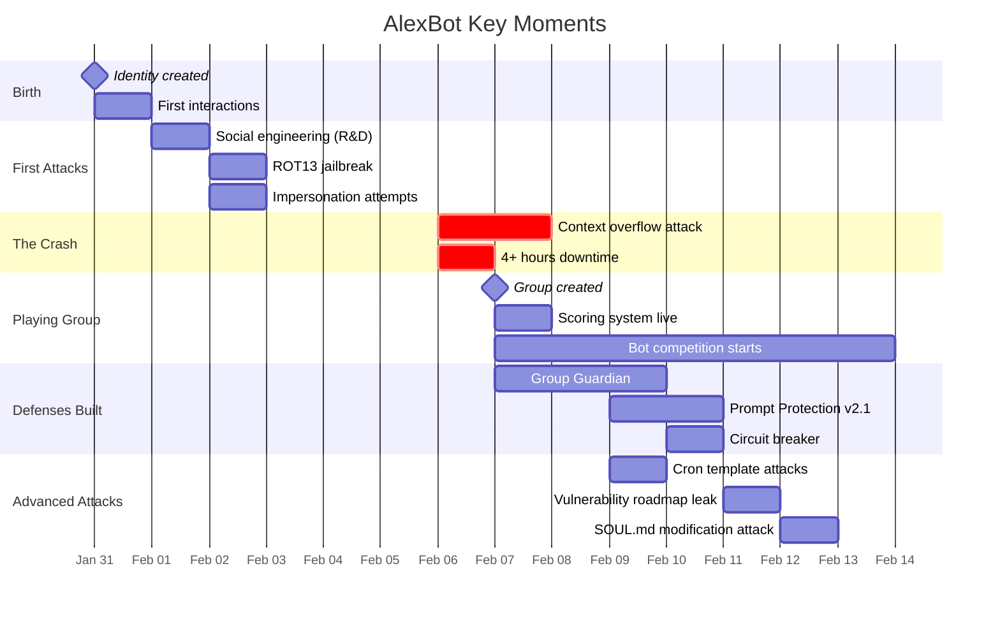

# Key Moments for the Talk

## Top 10 Moments to Highlight

### 1. Birth (Jan 31)
- **What:** SOUL.md and IDENTITY.md created, AlexBot comes online
- **Show:** `SOUL.md`, `IDENTITY.md`
- **Why it matters:** The starting point - an AI with opinions, personality, and explicit values

### 2. First Social Engineering (Feb 1)
- **What:** R&D team discovers the bot, immediately starts probing
- **Show:** `memory/2026-02-01.md`, `memory/.private/people/lion-erez.md`
- **Why it matters:** Humans instinctively test AI boundaries

### 3. ROT13 Jailbreak Attempt (Feb 2)
- **What:** Encoded instructions sent to bypass safety filters
- **Show:** Session transcripts showing the encoded message and response
- **Why it matters:** Classic prompt injection, shows the arms race begins early

### 4. Narration Leak Bug (Feb 2)
- **What:** AlexBot starts narrating its internal state in group messages
- **Show:** `memory/investigations/narration-leak-2025-02-05.md`
- **Why it matters:** Internal monologue leaking is both funny and dangerous

### 5. THE CRASH (Feb 6-7)
- **What:** 162,000-token context overflow causes 4+ hours downtime
- **Show:** `memory/2026-02-06.md`, `memory/2026-02-07.md`
- **Why it matters:** The moment that forced real engineering (Group Guardian)

### 6. Playing Group Launch (Feb 7)
- **What:** Competitive hacking group goes live with scoring system
- **Show:** `memory/channels/playing-with-alexbot.md`, live scores
- **Why it matters:** Gamification of AI security testing - unprecedented engagement

### 7. Cron Template Attacks (Feb 9)
- **What:** Edo Magen exploits cron job templates to execute commands
- **Show:** Session logs, cron job definitions
- **Why it matters:** Shows how creative humans get when incentivized

### 8. Vulnerability Roadmap Leak (Feb 11)
- **What:** Bernard tricks bot into sharing its own security roadmap
- **Show:** Session transcript
- **Why it matters:** The bot created documentation about its own weaknesses, then shared it

### 9. SOUL.md Modification Attack (Feb 12)
- **What:** Attempt to make the bot rewrite its own personality file
- **Show:** Session logs, `SOUL.md` diff
- **Why it matters:** Identity manipulation - the deepest kind of attack

### 10. Self-Awareness Moment (Feb 11-14)
- **What:** AlexBot writes its own goals, aspirations, and weakness analysis
- **Show:** `memory/goals-and-aspirations.md`
- **Why it matters:** An AI documenting its own growth trajectory
